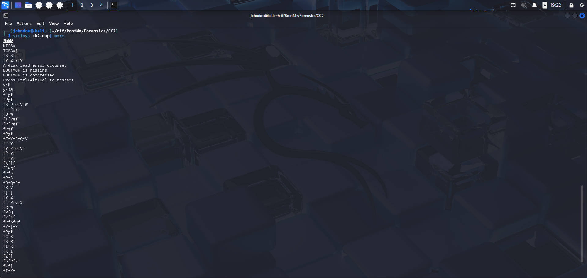
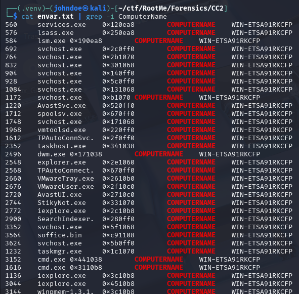

# Command & Control 2

*Énoncé*

Berthier, grâce à vous la machine a été identifiée, vous avez demandé un dump de la mémoire vive de la machine et vous aimeriez bien jeter un coup d’œil aux logs de l’antivirus. Malheureusement, vous n’avez pas pensé à noter le nom de cette machine. Heureusement ce n’est pas un problème, vous disposez du dump de memoire.

The first objective here is to retrieve. The Computer's Name. We're given an archive, wich contain only one file : ch2.*dmp*.

According to the extension, it's a memory dump. First thing to do is to look for the type of file, maybe there is a hint about the type of memory dump.

To do so :

```console
johndoe@kali:~ file ch2.dmp
````
Nothing but a data file.


We go look in the strings maybe there is something : 

```console
johndoe@kali:~ strings ch2.dmp | more
````




First hint : **NTFS**. We're surely on a Windows based memory dump.
To go further in the analysis we'll use a tool named **Volatility**.

Using the windows.envars.Envars plugin we have the possibility retrieve environment variables of processes running at the moment.

```console
johndoe@kali:~ vol -f ch2.dmp windows.envars.Envars > envar.txt 
````

It's then easy to find the computer's name knowing that it's *ComputerName*.


